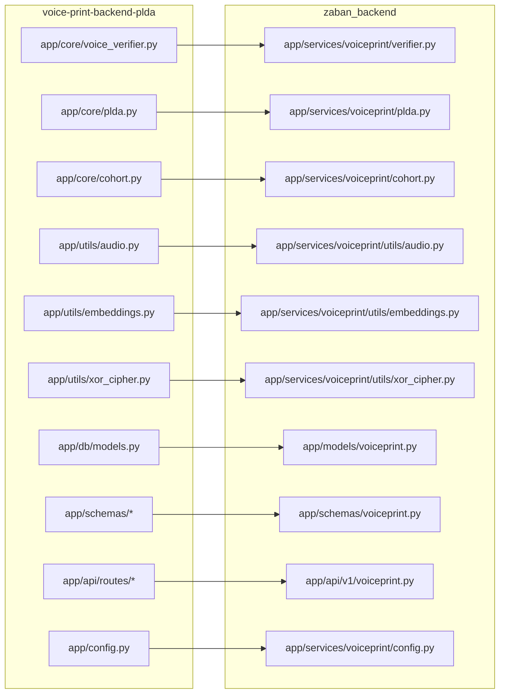

# Integrate voice-print-backend-plda into zaban_backend

Merge the standalone voice-print service into zaban_backend's existing module structure as a self-contained voiceprint feature. The folder structure already has empty placeholders ready; we move files, unify the DB schema against zaban's existing `users` table, and wire everything up.

## User Review Required

> [!IMPORTANT]
> **Sync vs Async DB**: Zaban uses **sync** SQLAlchemy (`psycopg`, `SessionLocal`). Voice-print uses **async** (`asyncpg`, `AsyncSession`). The plan converts all voice-print DB operations to sync to match zaban's existing pattern. If you'd prefer to add async support to zaban instead, let me know.

> [!IMPORTANT]
> **User model unification**: Voice-print has its own `users` table with `external_user_id`. The plan **removes** the separate voice-print users table and links `voiceprints` + `verification_attempts` directly to zaban's existing `users.id`. The routes will accept zaban user UUIDs. Does this approach work, or should voiceprint maintain a separate user-mapping table?

> [!WARNING]
> **Legacy routes**: Voice-print has two route sets — legacy (`/enroll`, `/verify`) and new PostgreSQL-integrated (`/users`, `/voiceprints`, `/verify`). The plan only migrates the **new PostgreSQL-integrated routes** since they are the complete, modern API. The legacy routes are superseded. Confirm if you also need the legacy routes.

---

## Proposed Changes

### Component 1: Database Schema (Alembic Migration)

Create a new Alembic migration that adds `voiceprints` and `verification_attempts` tables referencing the existing `users` table.

#### [NEW] [add_voiceprint_tables.py](file:///home/josh/JOSH/LingoAI/Zaban/zaban-backend-v1/zaban_backend/alembic/versions/YYYYMMDD_01_add_voiceprint_tables.py)

Tables to create:

| Table | Columns | Notes |
|-------|---------|-------|
| `voiceprints` | `id` (UUID PK), `user_id` (FK → `users.id`), `qdrant_vector_id` (UUID, unique), `model_name` (varchar), `is_active` (bool), `created_at` (timestamptz) | Partial index on `(user_id, is_active)` WHERE `is_active=TRUE` |
| `verification_attempts` | `id` (UUID PK), `user_id` (FK → `users.id`), `voiceprint_id` (FK → `voiceprints.id`), `probe_qdrant_vector_id` (UUID), `raw_plda_score`, `as_norm_score`, `threshold`, `decision`, `created_at` | Indexes on `user_id`, `voiceprint_id`, `decision`, `created_at` |

No separate `users` table — voice-print links directly to zaban's existing `users`.

---

### Component 2: SQLAlchemy Models

#### [MODIFY] [voiceprint.py](file:///home/josh/JOSH/LingoAI/Zaban/zaban-backend-v1/zaban_backend/app/models/voiceprint.py)

Populate with **sync** SQLAlchemy models adapted from `voice-print-backend-plda/app/db/models.py`:

- `Voiceprint` model — uses `Column()` style (matching zaban's `User` model), FK to `users.id`
- `VerificationAttempt` model — same sync style

Both use zaban's `Base` from `app.db.database`.

#### [MODIFY] [env.py](file:///home/josh/JOSH/LingoAI/Zaban/zaban-backend-v1/zaban_backend/alembic/env.py)

Add import: `from app.models.voiceprint import Voiceprint, VerificationAttempt`

---

### Component 3: Core Logic (move files)

Move the voice-print core modules into zaban's service structure. All imports will be rewritten from `app.core.*` / `app.utils.*` → `app.services.voiceprint.*`.

#### [MODIFY] [verifier.py](file:///home/josh/JOSH/LingoAI/Zaban/zaban-backend-v1/zaban_backend/app/services/voiceprint/verifier.py)

Source: [voice_verifier.py](file:///home/josh/JOSH/LingoAI/Zaban/zaban-backend-v1/voice-print-backend-plda/app/core/voice_verifier.py)

`VoiceVerifierECAPA` class — handles enrollment, embedding extraction, PLDA scoring, AS-Norm verification. Imports rewritten to `app.services.voiceprint.cohort`, `.plda`, `.utils.audio`, `.utils.embeddings`.

#### [MODIFY] [plda.py](file:///home/josh/JOSH/LingoAI/Zaban/zaban-backend-v1/zaban_backend/app/services/voiceprint/plda.py)

Source: [plda.py](file:///home/josh/JOSH/LingoAI/Zaban/zaban-backend-v1/voice-print-backend-plda/app/core/plda.py)

PLDA scoring functions: `plda_score`, `compute_cohort_plda_scores`, `compute_as_norm_score`.

#### [MODIFY] [cohort.py](file:///home/josh/JOSH/LingoAI/Zaban/zaban-backend-v1/zaban_backend/app/services/voiceprint/cohort.py)

Source: [cohort.py](file:///home/josh/JOSH/LingoAI/Zaban/zaban-backend-v1/voice-print-backend-plda/app/core/cohort.py)

Qdrant cohort helpers: `ensure_collection_exists`, `get_top_k_cohort_vectors`, `vector_to_list`.

#### [NEW] [audio.py](file:///home/josh/JOSH/LingoAI/Zaban/zaban-backend-v1/zaban_backend/app/services/voiceprint/utils/audio.py)

Source: [audio.py](file:///home/josh/JOSH/LingoAI/Zaban/zaban-backend-v1/voice-print-backend-plda/app/utils/audio.py)

Audio loading utility (`load_audio`).

#### [NEW] [embeddings.py](file:///home/josh/JOSH/LingoAI/Zaban/zaban-backend-v1/zaban_backend/app/services/voiceprint/utils/embeddings.py)

Source: [embeddings.py](file:///home/josh/JOSH/LingoAI/Zaban/zaban-backend-v1/voice-print-backend-plda/app/utils/embeddings.py)

`ECAPAEmbedder` class wrapping SpeechBrain model.

#### [NEW] [xor_cipher.py](file:///home/josh/JOSH/LingoAI/Zaban/zaban-backend-v1/zaban_backend/app/services/voiceprint/utils/xor_cipher.py)

Source: [xor_cipher.py](file:///home/josh/JOSH/LingoAI/Zaban/zaban-backend-v1/voice-print-backend-plda/app/utils/xor_cipher.py)

XOR decryption for frontend audio.

#### [NEW] [\_\_init\_\_.py](file:///home/josh/JOSH/LingoAI/Zaban/zaban-backend-v1/zaban_backend/app/services/voiceprint/utils/__init__.py)

Empty init for utils subpackage.

---

### Component 4: Pydantic Schemas

#### [MODIFY] [voiceprint.py](file:///home/josh/JOSH/LingoAI/Zaban/zaban-backend-v1/zaban_backend/app/schemas/voiceprint.py)

Merge all voice-print schemas into a single file:

- From `schemas/enrollment.py`: `EnrollmentResponse`, `UserInfo`, `UserListResponse`
- From `schemas/verification.py`: `VerificationResponse`, `CohortStatistics`
- From `schemas/users.py`: `VoiceprintResponse`, `VoiceprintUpdateRequest`, `VoiceprintUpdateResponse`, `VerificationAttemptResponse`

---

### Component 5: Configuration

#### [MODIFY] [.env.example](file:///home/josh/JOSH/LingoAI/Zaban/zaban-backend-v1/zaban_backend/.env.example)

Add voiceprint-related environment variables:

```env
# Voice Print Configuration
QDRANT_HOST=localhost
QDRANT_PORT=6333
PLDA_MODEL_PATH=./models/plda_model.pkl
ECAPA_SOURCE=speechbrain/spkrec-ecapa-voxceleb
ECAPA_SAVEDIR=./pretrained_models/spkrec-ecapa-voxceleb
VERIFICATION_THRESHOLD=3.0
COHORT_TOP_K=30
MIN_ENROLLMENT_SAMPLES=3
MAX_ENROLLMENT_SAMPLES=10
TARGET_SAMPLE_RATE=16000
XOR_AUDIO_KEY=voiceprint_xor_key_v1
VOICEPRINT_ENABLED=true
```

Config values will be read via `os.getenv()` in `app/services/voiceprint/config.py` (new file) to keep voiceprint config isolated from zaban's core config.

#### [NEW] [config.py](file:///home/josh/JOSH/LingoAI/Zaban/zaban-backend-v1/zaban_backend/app/services/voiceprint/config.py)

A `VoiceprintSettings` class (using `pydantic-settings`) encapsulating all voiceprint-specific config — Qdrant, PLDA paths, thresholds, collection names.

---

### Component 6: API Routes

#### [MODIFY] [voiceprint.py](file:///home/josh/JOSH/LingoAI/Zaban/zaban-backend-v1/zaban_backend/app/api/v1/voiceprint.py)

Adapted from voice-print's PostgreSQL-integrated routes. Key changes:

- **Sync DB sessions** — use `db: Session = Depends(get_db)` instead of `AsyncSession`
- **Remove voice-print user CRUD** — users are managed by zaban's existing auth system
- **Adapted endpoints**:

| Endpoint | Method | Description |
|----------|--------|-------------|
| `/voiceprint/enroll/{user_id}` | POST | Enroll voiceprint (audio files) for existing zaban user |
| `/voiceprint/verify/{user_id}` | POST | Verify audio against enrolled voiceprint |
| `/voiceprint/{user_id}/voiceprints` | GET | List user's voiceprints |
| `/voiceprint/{voiceprint_id}` | PATCH | Activate/deactivate voiceprint |
| `/voiceprint/{voiceprint_id}` | DELETE | Delete a voiceprint |
| `/voiceprint/verify/{user_id}/history` | GET | Get verification attempt history |
| `/voiceprint/health` | GET | Voiceprint service health check |

All endpoints verify the user exists in zaban's `users` table before proceeding.

#### [MODIFY] [\_\_init\_\_.py](file:///home/josh/JOSH/LingoAI/Zaban/zaban-backend-v1/zaban_backend/app/api/v1/__init__.py)

Add:
```python
from .voiceprint import router as voiceprint_router
router.include_router(voiceprint_router)
```

---

### Component 7: App Lifecycle

#### [MODIFY] [main.py](file:///home/josh/JOSH/LingoAI/Zaban/zaban-backend-v1/zaban_backend/app/main.py)

Add voiceprint verifier initialization in the `startup_event()`:

```python
# Initialize voiceprint verifier
if os.getenv("VOICEPRINT_ENABLED", "false").lower() == "true":
    from .services.voiceprint.verifier import VoiceVerifierECAPA
    # Initialize and store as app state
```

The verifier will be a singleton accessed via `get_verifier()`, gated by `VOICEPRINT_ENABLED`.

---

### Component 8: Dependencies

#### [MODIFY] [pyproject.toml](file:///home/josh/JOSH/LingoAI/Zaban/zaban-backend-v1/zaban_backend/pyproject.toml)

Add missing voice-print dependencies:

```diff
+  "torchaudio>=2.0",
+  "speechbrain>=1.0.0",
+  "scipy>=1.9.0",
+  "librosa>=0.10.0",
+  "qdrant-client>=1.7.0",
+  "asyncpg>=0.29.0",
```

> [!NOTE]
> `asyncpg` is needed by voice-print's Qdrant operations even though the main DB is sync. `torch` is already listed.

---

### Component 9: Data Files

The following data directories from `voice-print-backend-plda/` should remain accessible to zaban_backend. Either:

1. **Symlink** them into zaban_backend, OR
2. **Configure paths** via env vars (recommended)

| Directory | Contents | Env Var |
|-----------|----------|---------|
| `models/` | `plda_model.pkl` | `PLDA_MODEL_PATH` |
| `pretrained_models/` | SpeechBrain ECAPA model cache | `ECAPA_SAVEDIR` |
| `data/` | Cohort data | Used by scripts only |

---

## File Migration Summary



---

## Verification Plan

### Automated Tests

1. **Alembic migration dry-run** — verify schema generates correctly:
   ```bash
   cd /home/josh/JOSH/LingoAI/Zaban/zaban-backend-v1/zaban_backend
   alembic check  # ensures models match DB
   alembic upgrade head --sql  # dry-run SQL output
   ```

2. **Import verification** — ensure all modules import without errors:
   ```bash
   cd /home/josh/JOSH/LingoAI/Zaban/zaban-backend-v1/zaban_backend
   python -c "from app.models.voiceprint import Voiceprint, VerificationAttempt; print('Models OK')"
   python -c "from app.schemas.voiceprint import EnrollmentResponse, VerificationResponse; print('Schemas OK')"
   python -c "from app.services.voiceprint.config import voiceprint_settings; print('Config OK')"
   ```

3. **App startup smoke test** — verify FastAPI starts without errors:
   ```bash
   cd /home/josh/JOSH/LingoAI/Zaban/zaban-backend-v1/zaban_backend
   timeout 10 uvicorn app.main:app --host 0.0.0.0 --port 8001 || true
   # Check for import errors in output
   ```

### Manual Verification

- After implementation, please verify:
  1. The app starts with `VOICEPRINT_ENABLED=true` and the voiceprint health endpoint responds
  2. The `/docs` page shows the new voiceprint endpoints under `/api/v1/voiceprint/`
  3. If Qdrant + PLDA model are available, test enrollment and verification end-to-end
