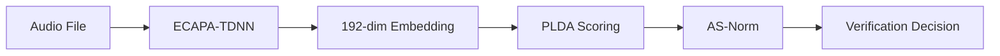

# Voice Print Backend - API Documentation

> **Version**: 1.0.0  
> **Base URL**: `http://localhost:8000`  
> **Authentication**: None (configure as needed for production)

---

## Table of Contents

- [Overview](#overview)
- [Authentication](#authentication)
- [Endpoints](#endpoints)
  - [Root](#root)
  - [Health](#health)
  - [Enrollment](#enrollment)
  - [Verification](#verification)
- [Data Models](#data-models)
- [Error Handling](#error-handling)
- [Configuration](#configuration)
- [Examples](#examples)

---

## Overview

The Voice Print API provides speaker verification capabilities using:

| Technology | Purpose |
|------------|---------|
| **ECAPA-TDNN** | Speaker embedding extraction (192-dim vectors) |
| **PLDA** | Probabilistic scoring between embeddings |
| **AS-Norm** | Adaptive Score Normalization using cohort |
| **Qdrant** | Vector storage and similarity search |

### Request Flow



---

## Authentication

Currently, the API does not implement authentication. For production deployments, configure appropriate authentication middleware.

---

## Endpoints

### Root

#### `GET /`

Returns API information and useful links.

**Response**

```json
{
  "name": "Voice Print API",
  "version": "1.0.0",
  "description": "Speaker Verification using ECAPA-TDNN + PLDA + AS-Norm",
  "docs": "/docs",
  "health": "/health"
}
```

---

### Health

#### `GET /health`

Basic health check endpoint.

**Response Model**: `HealthResponse`

```json
{
  "status": "healthy",
  "version": "1.0.0",
  "qdrant_host": "localhost",
  "qdrant_port": 6333
}
```

---

#### `GET /health/ready`

Readiness check - verifies service dependencies are available.

**Response Model**: `ReadinessResponse`

| Field | Type | Description |
|-------|------|-------------|
| `status` | string | `"ready"` or `"not_ready"` |
| `model_loaded` | boolean | Whether ECAPA model is loaded |
| `qdrant_connected` | boolean | Whether Qdrant connection is active |

**Example Response**

```json
{
  "status": "ready",
  "model_loaded": true,
  "qdrant_connected": true
}
```

---

### Enrollment

#### `POST /api/v1/enroll`

Enroll a new user with multiple audio samples.

**Content-Type**: `multipart/form-data`

**Request Parameters**

| Parameter | Type | Required | Description |
|-----------|------|----------|-------------|
| `user_id` | string | ✅ | Unique identifier for the user |
| `audio_files` | file[] | ✅ | Audio files for enrollment (3-10 required) |

**Audio Requirements**

- **Formats**: WAV, FLAC, MP3, or other common audio formats
- **Content**: Clear speech from the same speaker
- **Duration**: At least a few seconds per sample
- **Count**: Minimum 3, Maximum 10 files

**Response Model**: `EnrollmentResponse`

| Field | Type | Description |
|-------|------|-------------|
| `status` | string | `"success"` or `"error"` |
| `user_id` | string | User identifier |
| `message` | string | Human-readable message |
| `num_samples` | integer | Number of audio samples used |

**Example Request (cURL)**

```bash
curl -X POST http://localhost:8000/api/v1/enroll \
  -F "user_id=john_doe" \
  -F "audio_files=@sample1.wav" \
  -F "audio_files=@sample2.wav" \
  -F "audio_files=@sample3.wav"
```

**Example Response**

```json
{
  "status": "success",
  "user_id": "john_doe",
  "message": "User john_doe enrolled successfully",
  "num_samples": 3
}
```

**Error Responses**

| Status | Condition |
|--------|-----------|
| `400` | Less than 3 or more than 10 audio files |
| `400` | Invalid audio file format |
| `503` | Voice verifier not initialized |
| `500` | Internal enrollment error |

---

#### `GET /api/v1/enroll/users`

List all enrolled users.

**Query Parameters**

| Parameter | Type | Default | Description |
|-----------|------|---------|-------------|
| `limit` | integer | 100 | Maximum number of users to return |

**Response Model**: `UserListResponse`

| Field | Type | Description |
|-------|------|-------------|
| `users` | UserInfo[] | List of enrolled users |
| `count` | integer | Total number of users returned |

**Example Request**

```bash
curl http://localhost:8000/api/v1/enroll/users?limit=50
```

**Example Response**

```json
{
  "users": [
    {
      "user_id": "john_doe",
      "num_samples": 3
    },
    {
      "user_id": "jane_smith",
      "num_samples": 5
    }
  ],
  "count": 2
}
```

---

#### `DELETE /api/v1/enroll/{user_id}`

Delete an enrolled user.

**Path Parameters**

| Parameter | Type | Required | Description |
|-----------|------|----------|-------------|
| `user_id` | string | ✅ | User identifier to delete |

**Example Request**

```bash
curl -X DELETE http://localhost:8000/api/v1/enroll/john_doe
```

**Example Response**

```json
{
  "status": "success",
  "message": "User john_doe deleted"
}
```

---

### Verification

#### `POST /api/v1/verify`

Verify if an audio sample belongs to an enrolled user.

**Content-Type**: `multipart/form-data`

**Request Parameters**

| Parameter | Type | Required | Description |
|-----------|------|----------|-------------|
| `user_id` | string | ✅ | User identifier to verify against |
| `audio_file` | file | ✅ | Audio file containing speech to verify |

**Response Model**: `VerificationResponse`

| Field | Type | Description |
|-------|------|-------------|
| `verified` | boolean | Whether the speaker was verified |
| `score` | float | AS-Norm normalized score |
| `raw_score` | float | Raw PLDA score before normalization |
| `threshold` | float | Verification threshold used |
| `cohort_stats` | CohortStatistics | Cohort statistics from AS-Norm |

**CohortStatistics Model**

| Field | Type | Description |
|-------|------|-------------|
| `enrollment_cohort_mean` | float | Mean of enrollment cohort scores |
| `enrollment_cohort_std` | float | Standard deviation of enrollment cohort scores |
| `test_cohort_mean` | float | Mean of test cohort scores |
| `test_cohort_std` | float | Standard deviation of test cohort scores |
| `cohort_size` | integer | Number of cohort vectors used |

**Example Request (cURL)**

```bash
curl -X POST http://localhost:8000/api/v1/verify \
  -F "user_id=john_doe" \
  -F "audio_file=@test_audio.wav"
```

**Example Response (Verified)**

```json
{
  "verified": true,
  "score": 4.52,
  "raw_score": 12.34,
  "threshold": 3.0,
  "cohort_stats": {
    "enrollment_cohort_mean": 2.1,
    "enrollment_cohort_std": 1.5,
    "test_cohort_mean": 2.3,
    "test_cohort_std": 1.4,
    "cohort_size": 30
  }
}
```

**Example Response (Not Verified)**

```json
{
  "verified": false,
  "score": 1.23,
  "raw_score": 5.67,
  "threshold": 3.0,
  "cohort_stats": {
    "enrollment_cohort_mean": 2.5,
    "enrollment_cohort_std": 1.2,
    "test_cohort_mean": 2.8,
    "test_cohort_std": 1.3,
    "cohort_size": 30
  }
}
```

**Error Responses**

| Status | Condition |
|--------|-----------|
| `400` | Invalid request or audio file |
| `404` | User not found |
| `503` | Voice verifier not initialized or cohort empty |
| `500` | Internal verification error |

---

#### `POST /api/v1/verify/batch`

Verify multiple audio samples against an enrolled user.

**Content-Type**: `multipart/form-data`

**Request Parameters**

| Parameter | Type | Required | Description |
|-----------|------|----------|-------------|
| `user_id` | string | ✅ | User identifier to verify against |
| `audio_files` | file[] | ✅ | Audio files for batch verification |

**Example Request (cURL)**

```bash
curl -X POST http://localhost:8000/api/v1/verify/batch \
  -F "user_id=john_doe" \
  -F "audio_files=@test1.wav" \
  -F "audio_files=@test2.wav" \
  -F "audio_files=@test3.wav"
```

**Example Response**

```json
{
  "user_id": "john_doe",
  "results": [
    {
      "filename": "test1.wav",
      "verified": true,
      "score": 4.52,
      "raw_score": 12.34,
      "threshold": 3.0
    },
    {
      "filename": "test2.wav",
      "verified": true,
      "score": 3.87,
      "raw_score": 10.21,
      "threshold": 3.0
    },
    {
      "filename": "test3.wav",
      "verified": false,
      "score": 1.23,
      "raw_score": 5.67,
      "threshold": 3.0
    }
  ],
  "total": 3,
  "verified_count": 2
}
```

---

## Data Models

### Request Models

```python
class EnrollmentRequest:
    user_id: str           # Unique identifier for the user

class VerificationRequest:
    user_id: str           # User identifier to verify against
```

### Response Models

```python
class EnrollmentResponse:
    status: str            # "success" or "error"
    user_id: str           # User identifier
    message: str           # Human-readable message
    num_samples: int       # Number of audio samples used

class VerificationResponse:
    verified: bool         # Verification result
    score: float           # AS-Norm score
    raw_score: float       # Raw PLDA score
    threshold: float       # Threshold used
    cohort_stats: CohortStatistics  # Cohort statistics

class CohortStatistics:
    enrollment_cohort_mean: float
    enrollment_cohort_std: float
    test_cohort_mean: float
    test_cohort_std: float
    cohort_size: int

class HealthResponse:
    status: str
    version: str
    qdrant_host: str
    qdrant_port: int

class ReadinessResponse:
    status: str            # "ready" or "not_ready"
    model_loaded: bool
    qdrant_connected: bool

class UserInfo:
    user_id: str
    num_samples: int

class UserListResponse:
    users: List[UserInfo]
    count: int
```

---

## Error Handling

All error responses follow the FastAPI HTTPException format:

```json
{
  "detail": "Error message describing what went wrong"
}
```

### Common HTTP Status Codes

| Code | Meaning |
|------|---------|
| `200` | Success |
| `400` | Bad Request - Invalid input or validation error |
| `404` | Not Found - User or resource not found |
| `500` | Internal Server Error |
| `503` | Service Unavailable - Voice verifier not initialized |

---

## Configuration

### Environment Variables

| Variable | Default | Description |
|----------|---------|-------------|
| `QDRANT_HOST` | `localhost` | Qdrant server host |
| `QDRANT_PORT` | `6333` | Qdrant server port |
| `VERIFICATION_THRESHOLD` | `3.0` | AS-Norm threshold for verification decision |
| `COHORT_TOP_K` | `30` | Top-K cohort vectors for AS-Norm computation |
| `PLDA_MODEL_PATH` | `models/plda_model.pkl` | Path to trained PLDA model |
| `ECAPA_SOURCE` | `speechbrain/spkrec-ecapa-voxceleb` | ECAPA model source |
| `MIN_ENROLLMENT_SAMPLES` | `3` | Minimum audio samples for enrollment |
| `MAX_ENROLLMENT_SAMPLES` | `10` | Maximum audio samples for enrollment |
| `TARGET_SAMPLE_RATE` | `16000` | Audio sample rate in Hz |
| `HF_TOKEN` | None | HuggingFace token (optional) |

### Example `.env` file

```env
QDRANT_HOST=localhost
QDRANT_PORT=6333
VERIFICATION_THRESHOLD=3.0
COHORT_TOP_K=30
PLDA_MODEL_PATH=models/plda_model.pkl
```

---

## Examples

### Python (requests)

#### Enrollment

```python
import requests

url = "http://localhost:8000/api/v1/enroll"
files = [
    ("audio_files", ("sample1.wav", open("sample1.wav", "rb"), "audio/wav")),
    ("audio_files", ("sample2.wav", open("sample2.wav", "rb"), "audio/wav")),
    ("audio_files", ("sample3.wav", open("sample3.wav", "rb"), "audio/wav")),
]
data = {"user_id": "john_doe"}

response = requests.post(url, files=files, data=data)
print(response.json())
```

#### Verification

```python
import requests

url = "http://localhost:8000/api/v1/verify"
files = [("audio_file", ("test.wav", open("test.wav", "rb"), "audio/wav"))]
data = {"user_id": "john_doe"}

response = requests.post(url, files=files, data=data)
result = response.json()

if result["verified"]:
    print(f"✅ Verified! Score: {result['score']:.2f}")
else:
    print(f"❌ Not verified. Score: {result['score']:.2f}")
```

### JavaScript (fetch)

#### Enrollment

```javascript
const formData = new FormData();
formData.append("user_id", "john_doe");
formData.append("audio_files", audioFile1);
formData.append("audio_files", audioFile2);
formData.append("audio_files", audioFile3);

const response = await fetch("http://localhost:8000/api/v1/enroll", {
  method: "POST",
  body: formData,
});
const result = await response.json();
console.log(result);
```

#### Verification

```javascript
const formData = new FormData();
formData.append("user_id", "john_doe");
formData.append("audio_file", audioFile);

const response = await fetch("http://localhost:8000/api/v1/verify", {
  method: "POST",
  body: formData,
});
const result = await response.json();

if (result.verified) {
  console.log(`✅ Verified! Score: ${result.score.toFixed(2)}`);
} else {
  console.log(`❌ Not verified. Score: ${result.score.toFixed(2)}`);
}
```

---

## Interactive Documentation

FastAPI provides auto-generated interactive documentation:

- **Swagger UI**: [http://localhost:8000/docs](http://localhost:8000/docs)
- **ReDoc**: [http://localhost:8000/redoc](http://localhost:8000/redoc)

---

## Technical Notes

### Scoring Flow

1. **Embedding Extraction**: Audio → ECAPA-TDNN → 192-dimensional normalized vector
2. **PLDA Scoring**: Compute log-likelihood ratio between test and enrolled embeddings
3. **AS-Norm**: 
   - Compute scores between enrollment embedding and top-K cohort vectors
   - Compute scores between test embedding and top-K cohort vectors
   - Normalize the raw PLDA score using cohort statistics
4. **Decision**: `verified = score >= threshold`

### Qdrant Collections

| Collection | Purpose |
|------------|---------|
| `indian_cohort_ecapa` | Cohort embeddings for AS-Norm normalization |
| `enrolled_users_ecapa` | Enrolled user embeddings |

---

## License

MIT
